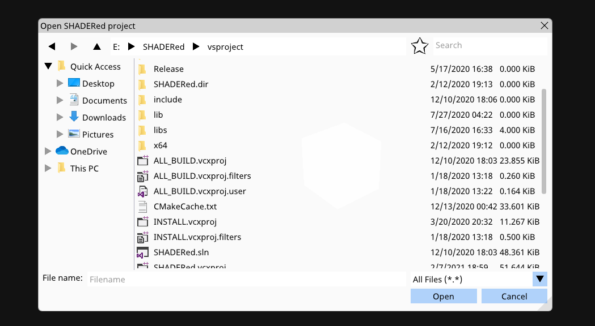
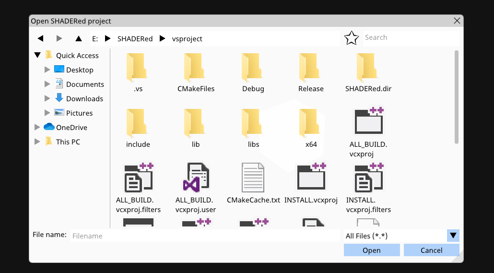
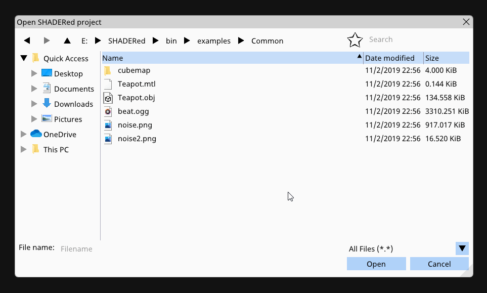
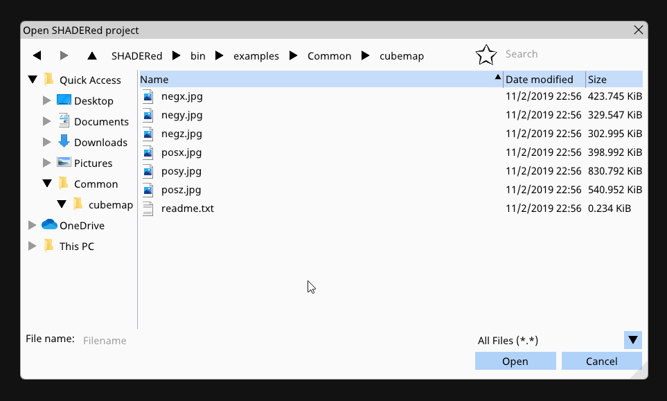

# ImFileDialog
A simple file dialog library for Dear ImGui.

This library supports favorites, actual Windows icons, image previews, zooming in, etc...

**DISCLAIMER**: This library was designed and built for use in [SHADERed](https://github.com/dfranx/SHADERed) - it uses older version of Dear ImGui so some changes might be required to get it compiled. The way the file filter  and the library itself looks was also limited due to me not wanting to break [SHADERed](https://github.com/dfranx/SHADERed)'s plugins.

## Requirements
This library uses C++17's `std::filesystem` but it also needs these libraries:
 * [Dear ImGui](https://github.com/ocornut/imgui/)
 * [stb_image.h](https://github.com/nothings/stb/blob/master/stb_image.h)

## Usage
To use ImFileDialog in your project, just add ImFileDialog.h and ImFileDialog.cpp to it.

Here's an example on how to use ImFileDialog:

1. You need to set the CreateTexture and DeleteTexture function
```c++
ifd::FileDialog::Instance().CreateTexture = [](uint8_t* data, int w, int h, char fmt) -> void* {
	GLuint tex;

	glGenTextures(1, &tex);
	glBindTexture(GL_TEXTURE_2D, tex);
	glTexParameteri(GL_TEXTURE_2D, GL_TEXTURE_MIN_FILTER, GL_NEAREST);
	glTexParameteri(GL_TEXTURE_2D, GL_TEXTURE_MAG_FILTER, GL_NEAREST);
	glTexParameteri(GL_TEXTURE_2D, GL_TEXTURE_WRAP_S, GL_CLAMP_TO_EDGE);
	glTexParameteri(GL_TEXTURE_2D, GL_TEXTURE_WRAP_T, GL_CLAMP_TO_EDGE);
	glTexImage2D(GL_TEXTURE_2D, 0, GL_RGBA, w, h, 0, (fmt == 0) ? GL_BGRA : GL_RGBA, GL_UNSIGNED_BYTE, data);
	glGenerateMipmap(GL_TEXTURE_2D);
	glBindTexture(GL_TEXTURE_2D, 0);

	return (void*)tex;
};
ifd::FileDialog::Instance().DeleteTexture = [](void* tex) {
	GLuint texID = (GLuint)tex;
	glDeleteTextures(1, &texID);
};
```

2. Open a file dialog on button press (just an example):
```c++
if (ImGui::Button("Open a texture"))
	ifd::FileDialog::Instance().Open("TextureOpenDialog", "Open a texture", "Image file (*.png;*.jpg;*.jpeg;*.bmp;*.tga){.png,.jpg,.jpeg,.bmp,.tga},.*");
```

3. Render and check if done:
```c++
if (ifd::FileDialog::Instance().IsDone("TextureOpenDialog")) {
	if (ifd::FileDialog::Instance().HasResult()) {
		const std::wstring& res = ifd::FileDialog::Instance().GetResult();
		printf("OPEN[%s]\n", std::string(res.begin(), res.end()).c_str());
	}
	ifd::FileDialog::Instance().Close();
}
```

File filter syntax:
```
Name1 {.ext1,.ext2}, Name2 {.ext3,.ext4},.*
```

## Running the example
If you want to test ImFileDialog, run these commands:
```bash
cmake .
make
./ImFileDialogExample
```

## Screenshots
**1. Table view:**



**2. Icon view:**



**3. Zooming in:**



**4. Favorites:**


**5. Image preview + threading (CTRL + scroll):**



## TODO
 * selecting multiple files
 * preview pane / layout options

## LICENSE
ImFileDialog is licensed under MIT license. See [LICENSE](./LICENSE) for more details. 